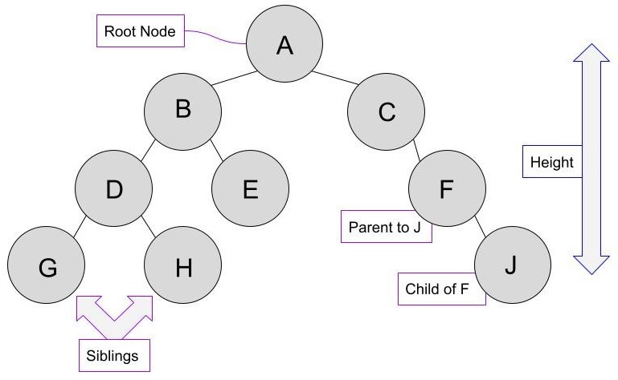
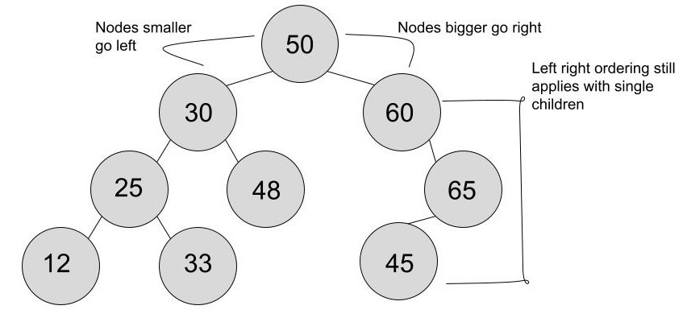

# Binary Search Trees

## What does hierarchial mean?

Much like an upside down tree, a binary search tree (BST) organizes data using roots and branches. A binary search tree is composed of nodes which each hold a piece of data. Nodes in a BST have parent child relationships. Every node in the tree will have a parent, except the root node. A node can have at most, 2 children.

Lets look at an examle of a tree.



### Root Node

In this tree, our root node is `A`. Every other node in this tree can be traced back to `A` in some fashion because they all are related to it.

### Height

The height of a tree is determined by the number of steps you need to get to the furthest away node. The height starts at the root node at one, then for each step to another node, you add one to the height. In this example, the height of our tree is `4`. J, G and H, are all the bottom nodes and the height of `4` could have been counted from any of them.

### Parent - Child Relationships

Every node in the tree except the root node has a parent. `F` and `J` have a parent child relationship in this diagram, `F` being the parent of `J`, and `J`, being the child of `F`.

## Ordering a Binary Search Tree

Lets take a look at another tree. This one demonstrates the `Left - Right` ordering rule.



### What is left right ordering?

When you start at the root node, in this example `50`, all children of the root node must either be larger or greater than the node. You cannot have a child with the same value as its parent.

#### Smaller

When a child is `smaller` than its parent, it will go to the `left` of the parent.

* 30 is smaller than 50, so it goes to the left side of the tree.

#### Larger

When a child is `larger` than its parent it will go to the `right` of  the parent.

* 48 is larger than 30 so it will go to the right of the parent.

### Other notes

Even if a parent only has a single child node, `it will still follow the left right` rules.

* 65 is a single child of 60, and its larger so it will go to the right of the parent.

## Lets Make a Tree

Making a tree takes a bit more work than our previous data structures. We will need to define the node structure, create the root node, insert children nodes, and learn how to traverse the tree.

### TreeNode Class

```csharp
public class TreeNode
{
    public int Data;
    public TreeNode Left;
    public TreeNode Right;

    public TreeNode(int data)
    {
        Data = data;
        Left = null;
        Right = null;
    }
}
```

This class represents a node in our system. Each node will contain `Data`, and each node will have 2 children available to have other nodes assigned to.

### BinaryTree Class

```csharp
public class BinaryTree
{
    public TreeNode Root;

    public BinaryTree()
    {
        Root = null;
    }
}
```

In this we have initiated our binary tree, and created our root node. Our root node is currently `null`, and we will assign data to it later.

## Lets add some Nodes

```csharp
class Program
{
    static void Main()
    {
        // using our classes, create a binary tree
        BinaryTree tree = new BinaryTree();
        // Assign our root node some data
        tree.Root = new TreeNode(10);
        // Using Left - Right ordering, add child nodes manually
        // Notice how you have to reference each parent node to 
        // traverse to where you will add a child node.
        tree.Root.Left = new TreeNode(5);
        tree.Root.Right = new TreeNode(15);
        tree.Root.Left.Left = new TreeNode(2);
        tree.Root.Left.Right = new TreeNode(7);
        tree.Root.Right.Left = new TreeNode(12);
        tree.Root.Right.Right = new TreeNode(17);
    }
}
```

We have now created a tree with our root node, and 7 nodes in total.

### Finding the height of our Tree

Because of the way trees are set up, we will have to use `recursion` to find the height of our tree. We are going to add another method to our BinaryTree class, that will use recursion to return the larget height it could find in any of the branches.

```csharp
private int Height(TreeNode node)
{
    if (node == null)
    {
        // If the root node is null,
        // Return 0
        return 0;
    }
    else
    // Otherwise our root node has children, and 
    // then we can start to count the height.
    {
        int leftHeight = Height(node.Left);
        int rightHeight = Height(node.Right);

        // Return the largest height found + 1 for the root node.
        return Math.Max(leftHeight, rightHeight) + 1;
    }
}
```

## Problem to Solve - File Structure

You will be given a tree. Your task is to:

* Print the data in every node by traversing the whole tree.
* Find the height of the tree.
* Manually add another node to the tree that will change the height of the tree.
* Check your work by checking the height of the tree again.

[Practice File](../datafinal\trees-problem\Program.cs)

[Solution](../datafinal\trees-problem\Solution.cs)

[Back to Welcome Page](Welcome.md)
