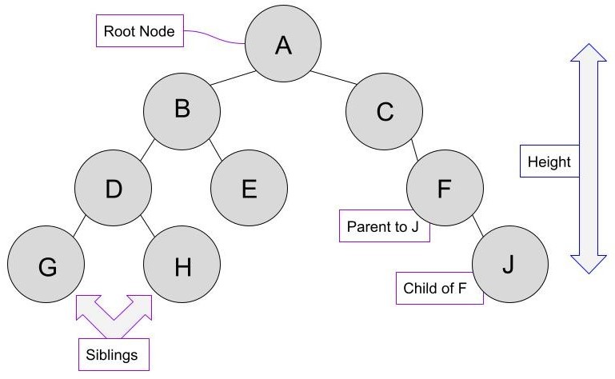
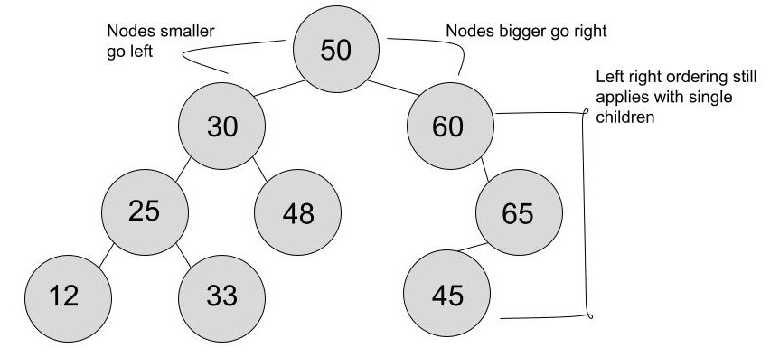

# Binary Search Trees

## What does hierarchial mean?

Much like an upside down tree, a binary search tree (BST) organizes data using roots and branches. A binary search tree is composed of nodes which each hold a piece of data. Nodes in a BST have parent child relationships. Every node in the tree will have a parent, except the root node. A node can have at most, 2 children.

Lets look at an examle of a tree.

### Root Node

In this tree, our root node is `A`. Every other node in this tree can be traced back to `A` in some fashion because they all are related to it.

### Height

The height of a tree is determined by the number of steps you need to get to the furthest away node. The height starts at the root node at one, then for each step to another node, you add one to the height. In this example, the height of our tree is `4`. J, G and H, are all the bottom nodes and the height of `4` could have been counted from any of them.

### Parent - Child Relationships

Every node in the tree except the root node has a parent. `F` and `J` have a parent child relationship in this diagram, `F` being the parent of `J`, and `J`, being the child of `F`.

## Ordering a Binary Search Tree

Lets take a look at another tree. This one demonstrates the `Left - Right` ordering rule.

### What is left right ordering?

When you start at the root node, in this example `50`, all children of the root node must either be larger or greater than the node. You cannot have a child with the same value as its parent.

#### Smaller

When a child is `smaller` than its parent, it will go to the `left` of the parent.

* 30 is smaller than 50, so it goes to the left side of the tree.

#### Larger

When a child is `larger` than its parent it will go to the `right` of  the parent.

* 48 is larger than 30 so it will go to the right of the parent.

### Other notes

Even if a parent only has a single child node, `it will still follow the left right` rules.

* 65 is a single child of 60, and its larger so it will go to the right of the parent.
